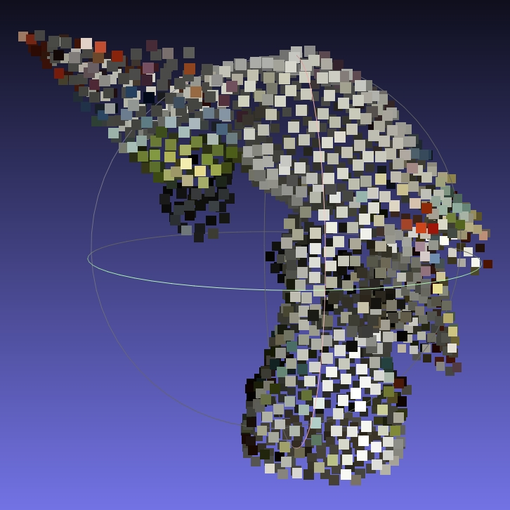

# Point Cloud Samples for Preservation Testing

This repository contains sample 3D point cloud files in various "archive-friendly" formats and subversions, designed for testing with digital preservation tools developed within the [NFDI4Culture](https://nfdi4culture.de/) project. The selection of these point cloud formats, including E57, LAS and PLY, is based on a prior identification of [Archive-Friendly 3D Formats](https://docs.google.com/spreadsheets/d/1c3EeDgJ2qWNWc35F35atYD4mgLkvk5tS7q632Ti-eDE/edit?gid=852170763#gid=852170763).

File conversions of sample files of this repository were performed using [Blender](https://www.blender.org/), [MeshLab](https://www.meshlab.net/), and [CloudCompare](https://www.danielgm.net/cc/). Some files may have been manually adjusted after export to ensure they meet their specifications. All files provided by this repository aim to support robust workflows for validating and preserving 3D data.

## Files

This repository provides the following objects in different formats:

| Object     | Description                   | Points                    | Additional Features | Preview                                                                    |
| ---------- | ----------------------------- | ------------------------- | ------------------- | -------------------------------------------------------------------------- |
| `minimal`  | Empty scene                   | 0 if allowed, otherwise 1 | None                |                                              |
| `cube`     | Simple box                    | 4                         | None                |                                                 |
| `cockatoo` | 3D-scanned porcelain cockatoo | 518,889                   | Colors              | [^1] (simplified for illustration purposes) |

### File Naming Convention

Files are named as follows:  
`[object]-[format]-[version]-[modification]-[status].[extension]`

- **`-valid`**: Files pass validation using the project's validator scripts.
- **`-unknown`**: Files could not be validated due to the lack of suitable tools.

## Outlook and Conclusion

Validators for E57 and LAS have been identified. However, tools for PLY are still required and must be developed following their official specifications. Once these are available, the corresponding 3D sample files will be further validated and refined to ensure compliance, enhancing the robustness of digital preservation workflows. Contributions to this effort are welcome.

## Related Projects

- [NFDI4Culture 3D Reference Implementations](https://github.com/JoergHeseler/nfdi4culture-3d-reference-implementations)

## Acknowledgments

Special thanks to Grischka Petri and the colleagues from the SLUB Dresden, particularly the IT-Infrastructure and Digital Long-Term Preservation unit, for their invaluable support and feedback.

## Imprint

[NFDI4Culture](https://nfdi4culture.de/) – Consortium for Research Data on Material and Immaterial Cultural Heritage.  
Funded by the German Research Foundation (DFG), Project No. [441958017](https://gepris.dfg.de/gepris/projekt/441958017).

**Author**: [Jörg Heseler](https://orcid.org/0000-0002-1497-627X)  
**License**: [CC BY-SA 4.0](https://creativecommons.org/licenses/by-sa/4.0/)

### Licenses

[^1]: The ["Kakadu von Johann Joachim Kaendler, Meissen" (Cockatoo by Johann Joachim Kaendler, Meissen) 3D models](https://sketchfab.com/3d-models/cockatoo-von-johann-joachim-kaendler-meissen-ddebac799fa14d389a6acc68f9cbfcdf) and associated textures are provided by [ZDF Digital](https://zdf.digital/) and [Porzellansammlung, Staatliche Kunstsammlungen Dresden (Porcelain Collection, Dresden State Art Collections)](https://www.skd.museum/). These are licensed under [CC BY-SA 4.0](https://creativecommons.org/licenses/by-sa/4.0/). The original GLB file from Sketchfab was used and converted into other formats as needed. Files may have been intentionally modified to test the tools developed for digital preservation.
